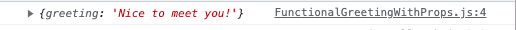

# 

This repository is a place for me to store my notes and thoughts on the introduction to React bonus content provided by the Code Institute.

Official documentation for Reactjs: [reactjs.org](https://reactjs.org/)

* [Lesson 1: An introduction to the example project](#lesson-1---an-introduction-to-the-example-project)
* [Lesson 2: Introduction to JSX](#lesson-2---introduction-to-jsx)
* [Lesson 3: Creating your first React App](#lesson-3---creating-your-first-react-app)
* [Lesson 4: React developer tools](#lesson-4---react-developer-tools)
* [Lesson 5: React components](#lesson-5---react-components)
* [Lesson 6: Functional components](#lesson-6---functional-components)
* [Lesson 7: Props](#lesson-7---props)
* [Lesson 8: Class Components](#lesson-8---class-components)
* [Lesson 9: What is State?](#lesson-9---what-is-state)
* [Lesson 10: Updating the State](#lesson-10---updating-the-state)
* [ES7 Snippets](#es7-snippets)
* [Lesson 11: Handling Events in React](#lesson-11---handling-events-in-react)

---

## Lesson 1 - An Introduction to the Example Project

This lesson uses the **react-example** folder.

### What is Reactjs?

Reactjs is an open source JavaScript library developed & maintained by Facebook. Reactjs is used for building fast and interactive user interfaces. At its core, React applications are composed of components, which are small JavaScript files written in JSX (a special JavaScript syntax).

Each of the components works like its own little web application and are able to perform many tasks, such as make HTTP requests, communicate with servers and APIs, communicate
with one another, and update themselves in response to user interactions. Multiple components are used together to create a user interface, where each component makes up a small part of the UI, like a navigation menu, an individual tweet or post, a button, or a form. Individual components are completely independent of one another, so individual parts of the user interface can update independently and in real time, without refreshing the page. Components are also reusable, which means you only have to write the code once, and it can then be reused over and over throughout your application, or even reused in a completely different application.

All these features make React scalable, easy to maintain and incredibly flexible. As a front end library, the React philosophy is to do one thing, and do it really well. React is responsible for the way the application looks and feels. By coupling it with a full stack framework like Django, or a back end server environment like NodeJS, you can build powerful full stack applications with interactive, asynchronous front ends capable of being completely disconnected and independent from the back end.

### How to run the app locally

The entire project is contained within the **react-example** folder.

1. Change directory into the folder using the cd command: `cd react-example`
2. Start the app with the command: `npm start`
3. This will open the app in a new browser window for you to view.

### What do the files do?

* package.json

    Think of this as the configuration file for your React app. It is a JavaScript object that contains a number of properties that define the configuration of the app. Our example contains a name, and version number for the app and also contains a list of dependencies required for the app to run. It also includes some pre-made scripts which are used to start, stop and test the app, to name just a few. This file is highly configurable and it can be created automatically using software, or you can create it yourself.

* public/index.html

     This is the file that is served when the app is visited. The key piece of code in this file is the div with an id of root, as this is where all your react components will be rendered at runtime in order to create the user interface.

     There is a noscript tag just above the div that renders the message: *You need to enable JavaScript to run this app* which is shown if the users browser doesn't support JavaScript.

* src/app.js

    App.js is the react component that renders the content you see in the preview window. In this case, App.js defines a function called App and this is the actual React component. The function returns a strange looking combination of HTML and JavaScript, a language called JSX. At the bottom, the function is exported, allowing it to be imported into other files in the project, so that it can be reused as needed.

* src/index.js

    Index.js is the JavaScript file that gets run when you first load the app. Inside it is where the magic happens. First there are some imports including React, ReactDom, some CSS, and the app component from app.js. Then, ReactDom.render is called in order to render the App component in that root div with the ID of “root” in index.html.

* src/app.css

    Contains the CSS for the app.js component.

* src/index.css

    This contains the CSS for the index.html page.

NOTE: It would generally be fine to place the CSS in the one file - however React developers prefer to separate out the component CSS so that if a component is reused, the CSS also goes with it.

### The Application Flow

When someone navigates to your page, the empty index.html page is rendered containing the shell of the application - the basic HTML structure and the empty root div. Then, index.js is run, which imports React and React Dom as well as the App component, and renders the app component into the root div. The app component itself is where the actual HTML you see in the preview window is defined, and it can be modified or reused as required. Most React apps have lots of small components like App.js, and each component renders a specific part of the UI. Together, they make up the entire user interface and can provide all sorts of interactivity.

So, to review, Index.html contains basic page structure and the empty root div, the root div ends up with the App component rendered into it, and that is done when index.js is run. This is the basic flow of any React application. The configuration for all these files and how they work together is managed with package.json. Everything else you see here is secondary to understanding how a React application works.

---

## Lesson 2 - Introduction to JSX

This lesson uses the **jsx-example** folder.

JSX is an extension to the JavaScript language which allows us to simplify our React code. Support for JSX is built into React which means we can use it without any special conditions. A good way to think about JSX elements is that they are custom HTML tags which can have any name you want.

Both the App component and the index.js file use JSX syntax. Like regular XML or HTML elements, JSX Elements can have attributes like classes, ID's and names, and can have parents, children and siblings. Although JSX is not necessary to write React applications, in reality React developers use it because it's simpler, more elegant and easier to read and maintain. When your app is run, the JSX code gets transpiled (converted) to vanilla JavaScript which the browser can understand.

To see what a React component looks like without using JSX, take a look at: [app component](jsx-example/src/App.js). This renders a simple HTML structure of a div with a couple of children. In the example, instead of returning JSX code, the App component returns a call to `React.createElement`. The `React.createElement` function takes three parameters:

* The element to create (in the example, a div)
* An object of properties to apply to that element, such as class names and IDs
* An arbitrary number of children elements

In this example, the div has one child, a `<header>` element - which has a child itself, an `<h1>`, and that `<h1>` itself has a child text node containing the text. The div and the header have one class each, specified by the `className property`, and the `<h1>` element has no attributes so that parameter is set to `null`. This component renders the same result in the preview window as the JSX component, which is commented out above it.

However without JSX, something as simple as creating the grid for your page layout or creating a form becomes incredibly complex, since every single element would require a call to `react.createElement()`. Creating a real-world react website without JSX would be prohibitively complicated. JSX simplifies the syntax for calling `react.createElement` . By using JSX, you can write your code so it looks mostly the same as standard HTML, but with the added benefit of being able to inject and use JavaScript wherever you need to do something HTML can't handle.

As React is writen in JavaScript files, and some words are reserved in JavaScript - we will sometimes need to use different terminology than we would in HTML. For example, we would need to use the property className rather than class to define a class. This is then transpiled down to class in the HTML displayed in the browser (You can check this by inspecting the page with dev tools). Other examples include for, which becomes htmlFor, and onclick and tabindex, which are replaced with their camelCased versions onClick and tabIndex.

Custom JSX elements and the React components they represent must also be capitalized (like App). This allows the transpiler that converts the JSX to vanilla JavaScript to tell the difference between the custom JSX elements and standard HTML elements. All components should be capitalized when defining them and when referring to them in JSX code.

**Further Reading:** [React Docs - JSX in-depth](https://reactjs.org/docs/jsx-in-depth.html)

---

## Lesson 3 - Creating your first React App

In order to create our React app we need to couple it with [nodejs](https://nodejs.org/en/docs/). nodejs is an opensource JavaScript runtime and allows us to run our development server while we write React code and takes care of converting our React code to vanilla JavaScript to enable it to run in the browser. It allows us to use the Node Package Manage (NPM) to install packages and extensions for our React apps. We have already used one of these NPM commands in the first lesson: `npm start`. Node Package Manager is a tool that is distributed with nodejs to allow us to install and uninstall packages, run development servers and create and destroy React applications. It also allows us to use npx, which executes node packages.

### Using GitPod

1. Create a GitHub repository for your app.
2. Use the green GitPod button on the repository page to open a GitPod workspace.
3. As node is pre-installed in GitPod, we can use the command `npx create-react-app my-app-name-here --use-npm` to create the React application.

    * The `create-react-app` tool is great as it gives us all the boilerplate code we need to start a React app. Many developers use this to get their apps running, and will then delete anything they don't need and make adjustments where necessary.

    * We have used the `--use-npm` flag to ensure that we are using npm because we are creating the app in GitPod, which would by default use a different package manager called yarn.

4. This can take several minutes to complete, but when done you will be able to see that npx has created a new React app in the my-app-name-here folder. Inside this folder will be a node_modules folder, which is where everything npm installs will be stored and is where the React app will look for any packages it needs.
5. To run the app, first `cd` into the app and then run the command `npm start`. Now we have a React app ready for us to start creating our components.

---

## Lesson 4 - React Developer Tools

Google Developer Tools can be very useful when working with React apps. There is also a Chrome extension called [React Developer Tools](https://chrome.google.com/webstore/detail/react-developer-tools/fmkadmapgofadopljbjfkapdkoienihi?hl=en) that can be downloaded from the Chrome webstone, which alows us to to examine and tweak React apps we're building, rather than the HMTL it generates. Once installed it can be pinned to the Chrome toolbar which will allow us easy access.

The React developer tool is a great way to identify sites that are developed in React. The icon will highlighted as blue when viewing a site that uses React, and will be greyed out on ones that don't. If you inspect an element on a site using React, the components tab will automatically highlight the element you selected.

Note: When viewing the components on the web remember that you are viewing the optimised production build, which minifies and compresses all component names to keep the JavaScript as small as possible. In development mode, you will be able to see the real component names.

When viewing the components tab in developer tools you will be able to see the props (properties) on the right. This allows you while developing your own apps to see what properties your components currently have and how changes to the property affect the component.

Another useful tool is component highlighting which can be found by clicking on the settings and then choosing highlight updates when components render. Doing this will show you how active a large scale site (such as Twitter, Facebook or Instagram) is under the surface. Each time a component rerenders and receives a new property or state, it will be highlighted. Rerenders can be caused by many things, like a mouse moving over an element, scrolling the page, clicking a link etc. When a component rerenders, its is similar to a page refresh, but just for that component. When sites get larger, these component rerenders can start to slow the site down if they are not optimised and are rerendering needlessly, and so this is another useful way to utilise the React developer tools.

The React developer tools also have a Profiler tab which can be used to determine how long different components are taking to load and where optimisations could be possible.

---

## Lesson 5 - React Components

This lesson uses the **[react-components](react-components/)** folder.

A React application is a collection of components composed together to create a user interface. There are two main types of components: Stateless Functional Components & Stateful Class Components.

Inside the src/components folder are three components: FunctionalGreeting, HooksCounter and StatefulGreeting. Each of the components has been written in its own JavaScript file so that it can be reused as needed and is named using the PascalCase convention which allows React to be able to tell it apart from the standard HTML elements in the JSX.

The first file, [FunctionalGreeting](react-components/src/components/FunctionalGreeting.js), is a stateless functional component. It is a JavaScript function that returns the HTML shown in the preview window. As it is a function, it is also able to take parameters. The standard for this type of component is to take a parameter called *props* (this is short for properties). This prop parameter contains the properties which determine what the component should display (render). In this example, props contains a name which is rendered as part of the JSX. The actual name comes from the name attribute, which is specified wherever we include the component. By using this prop we can use this component to render a greeting for any name we wish. However it is important to know with stateless functional components, once they've rendered their props, the output will always remain the same.

The file [StatefulGreeting](react-components/src/components/StatefulGreeting.js) is an example of a stateful class component. While stateless functional components always remain the same once rendered, stateful class components are able to change. They do this by using the state, which is a JavaScript object that contains various properties.

The initial state (the one values the state has the first time the component renders) are defined in the *constructor method*. For the example file the initial state provides the component with a state property called *count* that is initialised to 0. State properties can be accessed within the component by accessing *this.state* and can be changed at will, which means a stateful component is able to change at any time by updating their state. There are many things that can update a state, but it is usually a user interaction - like the button in our example. When we click the button, the setCount method is called which increments the count by one, and then rerenders the component with the new state, containing the new count. If we refresh the window the count is set back to 0 as defined in its initial state in the constructor. Stateful components are also able to take props.

Which type of component is best to use? That will depend on their use case. It is generally preferred to use functional components as much as you can, and only to use class components when the component needs to have some sort of interactivity. Due to being less complex, functional components are good for static components that just need a few props to tell them what to render, and that won't change. However if you need to change the props or require any interactivity - stateful class components will suit your requirements better.

React hooks are a newer React feature that allow us to use some features of each component type interchangably - so a built in React function that you can add to a stateless functional component that will allow it to behave like a stateful component. An example of this is shown in [HooksCounter](react-components/src/components/HooksCounter.js) which has the same functionality of the stateful class component, StatefulGreeting. This is due to the use of the useState hook, which allows us to give the functional component a state property called count, create a method to update it called setCount, provide an initial value of 0 and then call the method when the button is clicked. It provides the same functionality of the stateful component, just with a lot less code. For this reason, hooks are being used increasingly more as a replacement of stateful class components, due to them accomplishing the same task with less code, and without having to use the *this* keyword or constructor.

However it is still important to know how a stateful class component works, to be able to truely understand how hooks work using states.

**Further Reading:** [React Functional Components vs Class Components](https://articles.wesionary.team/react-functional-components-vs-class-components-86a2d2821a22)

---

## Lesson 6 - Functional Components

The outcome of these lessons, creating my first react app, are stored in the **[my-first-react-app](my-first-react-app/)** folder.

The app function in [App.js](my-first-react-app/src/App.js) is itself a functional component, and because there is only one single root div in the [index.html](my-first-react-app/public/index.html), which is where this app component is rendered and where the whole app lives, we're going to use this component as a parent component and nest all other components inside it.

To create a functional component from scratch:

1. Create a folder in the *src* directory called *components* and then inside that create a file called *FunctionalGreeting.js* (Note: the PascalCase convention used to name the file - this is required for React components).
2. Import React from react. Note that in the latest versions of React this step is not required - however we are adding it to make it clear what we are doing while learning. This will also ensure that our components are backwards compatible with earlier versions of React.
3. Create the function that will return some HTML.
4. The function won't currently do anything as it's not included in the rest of the application. To include it we will need to export the function from the current file and then import it where we want to use it, in this example the App.js file. This will then allow us to use the FunctionalGreeting component in App.js. This process of writing a component, exporting it and then importing it into the main App file is the basis of how user interfaces are created in React.
5. In the App div we are now going to add the custom JSX element, FunctionalGreeting. As this component is totally independent and has no other content other than what it renders itself, it doesn't need a closing tag, so we can self close it with a space slash. (Some more advanced apps have components which wrap around other components, so these would require to be closed like you do other HTML elements with a closing tag.)

To use more modern syntax, this function could be written as an arrow function instead, which makes the code cleaner and shorter (although this can also make code a bit harder to read at first until you get used to the shortened syntax).

Both versions are in the file to allow comparison.

**[Finished Source Code Repo](https://github.com/Code-Institute-Solutions/gitpod-react/tree/b73da3590fd4cb5101cf7c8470b63ee37f84840f/my-app/src)**

---

## Lesson 7 - Props

The outcome of these lessons, creating my first react app, are stored in the **[my-first-react-app](my-first-react-app/)** folder.

Props can make our functional components more flexible and dynamic. Currently our component only renders the single greeting 'Hello from React'. We could add this component to our App several times, but it would always return the same greeting. If we wanted to be able to return different greetings, we would need to use props.

Props is short for properties. Props are the parameter that are passed into the react component which tell it what to render and how.

To show how props work, we will create a `FunctionalGreetingWithProps` component, change the greeting to hello and then import this into `App.js`. We will then add the component below our FunctionalGreeting component in the App return. We should be able to see this hello greeting in our preview.

Note: As we are returning more than one component in the return, jsx requires that they are wrapped in a div. We used this div in the previous lesson with one component, which wasn't required - however if the return has more than one component, then it will be required.

Props are specified as attributes to the component in the same was as attributes are specified in HTML (like class or id). The difference with React props is that you can call them anything you want, and specify as many as you want.

To add the prop to our FunctionalGreetingWithProps component, we simply add the prop after the component name in App.js:

```js
<FunctionalGreetingWithProps greeting="Nice to meet you!"/>
```

We then need to retrieve the prop in the component, and render it as part of the JSX in FunctionalGreetingWithProps.js. We can do this by passing the props to the function which  will now exist as an object inside the function. 

We can then check this by console logging the props. (As there are now multiple lines of code, we will need to open curly brackets and add a return for the jsx.)

```js
const FunctionalGreetingWithProps = (props) => {
    console.log(props);
    return <h1>Hello</h1>;
}
```



To access this prop by injecting javascript code into the component using jsx. To do this we use the curly braces and then pass it `props.greeting`:

```js
return <h1>Hello, {props.greeting}</h1>;
```

We should now be able to see our greeting rendered in the preview. We can pass any type of prop, javascript variable or expression in the jsx by wrapping the javascript in the curly braces.

If we wanted to add more than one prop, we simply separate them with a space. As our greeting component now accepts props we could render any greeting we wanted using this one component, or even add more props to make it more flexible.

Props are used to determine what the component renders and how it renders it, for example what colour it should be, whether parts are disabled etc.

**[Finished Source Code Repo](https://github.com/Code-Institute-Solutions/gitpod-react/tree/b7e7da047b80911501e57d6dfb9ae090ad4c5dee/my-app/src)**

---

## Lesson 8 - Class Components

The outcome of these lessons, creating my first react app, are stored in the **[my-first-react-app](my-first-react-app/)** folder.

In the previous lesson, we created a stateless Functional Component - this is a component that doesn't keep track of anything internal to themselves, and always render the same thing whether or not they include props, and once rendered, cannot change unless they are given new props.

Stateful Class Components however are able to maintain their own private internal set of properties which describe what to display and how to behave. These properties are maintained in the state object, and can be updated in response to user interactions (like clicking a button, moving the mouse or typing on the keyboard). Stateful components are also able to take props like functional components, however these props act in the same way as they do in a functional component, in that once the component is rendered the props cannot be changed. State however, can be updated and changed at will which makes them more dynamic and flexible compared to stateless components.

To create a class component, we will first need to import React and then create the class using the class keyword followed by the name of the component. We will also need to add extends React.Component to convert this from a JavaScript class to a React Class. Then within the component we will need to define the render method to allow us to return the jsx that we place inside of it.

Passing a prop into a stateful class component is slightly different - we will need to use the this keyword to allow access to the prop - `this.props.greeting`. Like functional components we can pass as many props into a class component as we want, we just need to separate them with a space.

**[Finished Source Code Repo](https://github.com/Code-Institute-Solutions/react-essentials/tree/b7e7da047b80911501e57d6dfb9ae090ad4c5dee/my-app/src)**

---

## Lesson 9 - What is State?

The outcome of these lessons, creating my first react app, are stored in the **[my-first-react-app](my-first-react-app/)** folder.

In class components, the state is usually defined in a contructor. First we need to add the `super();` function as this allows us to use the constructor from the parent class, and in this case we want to make sure that React.Component is called. 

Next we can define the state using `this.state = {}` we start by defining the state as an empty object, so that as soon as the class is instantiated, we are able to access and manipulate the state. Its best practice to pass the props through the constructor and the super functions so that props passed through to the component are also passed through when calling super.

Next we will give our state object some values which are called the initial state. They will represent the initial values of anything the component changes on its own or due to user interaction. We can add as many state properties as we want in the constructor.


*Mutable state*: Mutable means it can change - so the state is changable.

We need to add parentheses to the return as we will be returning more than one line of code, and also wrap our jsx with a div, as react will only return one element from a render.

**[Finished Source Code Repo](https://github.com/Code-Institute-Solutions/react-essentials/tree/c0a87c4ebf709508e7c48d2a1f0006abc74a3974/my-app/src)**

---

## Lesson 10 - Updating the State

To make the button functional, allowing it to update the state of the StatefulGreeting component we will need to do the following:

* Give the button an `onClick` attribute
* Write an event handler method to listen for the `onClick` event
* Within the handler, use a `setState` method to update the state

You may notice in the console that when we click the button the greeting logged to the console is the old state rather than the new changed state, even though the new state is being rendered correctly in the component. This is happening because the values you see in the console are the values the state had just before the button was clicked.

`setState` is an *asynchronous function*. this means that its capable of functioning in the background while other code continues executing.

*callback functions* are executed only once the code in an asynchronous function completes.

The reason why it console logs like this is because calls to `setState` are asynchronous, so it is executing in the background while the rest of the code continues to execute. This means that the `console.log` are actually executing *before* the state update happens, so the values logged are the values that were in the state before `setState` was called.

To resolve this there is a second from of the `useState` method we can use, which takes a *callback function* as the second parameter. The callback function will always execute after the `setState` has finished.

*Note:* This type of callback function is what is used when using fetch API. As fetch can take time to go out and make the request or download data, a callback function is passed to it to rely on the fetch completing, and once it does the callback function would execute.

The callback function we are going to pass to `setState` functions in the same way.

So any time we work with `setState` and need to run some code after the state update is complete we need to place the code in a callback function as a second parameter to the `setState` **NOT** immediately after the `setState` call, as doing so would make the code execute before the state update is completed. By placing the code as a callback function to the `setState` method we guarantee our code will always execute after the state is complete.

**[Finished Source Code Repo](https://github.com/Code-Institute-Solutions/react-1-18-49/tree/4329ab8b6d1cc8270eac7a01ceb9856854f99dda)**

### Setting State - the wrong way

To determine the current value of the introduction text and button text, to allow us to update the state dependant on their values we can use a ternary conditional statement in the setState method:

```js
    introduction: this.state.introduction === "Hello!" ? "Goodbye!" : "Hello!",
```

This ternary conditional statement means if the introduction is hello it will change to goodbye, otherwise it will change to hello.

This way will however have an issue in more complex cases. We've added an increment button that adds one each time the button is clicked, which works, but when we add a method to increment 5 each time the button is clicked we hit an issue.

Rather than incrementing the count by 5 each click, we are only incrementing by one and the value is being logged 5 times in the console. This is happening because React groups multiple calls to setState into a single call for better performance, which means our 5 calls to setState are being grouped into one single call to prevent the component rerendering 5 times, and only rerenders once on the final call to this.increment.

**[Finished Source Code Repo](https://github.com/Code-Institute-Solutions/react-1-18-49/tree/a2350d8eba7621c34d74a3d7b1546ffc331d0869)**

### Setting State - the right way

When dealing with state updates that depend on the previous state of the component, there is a third  form of the setState method that must be used.

This takes a function as the first parameter to setState. The function can take two parameters, the previous state, and the previous props. It returns an object that will be used to create the new state. We then will return the state.

Sometimes these types of issues don't become obvious until you use more complex code. Because of this it is really important to follow best practices when using setState to prevent strange problems that can be difficult to debug.

**[Finished Source Code Repo](https://github.com/mr-fibonacci/react-1-18-49/tree/cd06dfa8607fe31644d4980f9beb55f5d4eca23c)**

**[Updating the State Cheet Sheet](documentation/Updating-the-State-Cheat-Sheet.pdf)**

---

## ES7 Snippets

We will be using an extension for ES7 snippets, [ES7+ React/Redux/React-Native snippets](https://marketplace.visualstudio.com/items?itemName=dsznajder.es7-react-js-snippets)

* [ES7 Snippets Cheat Sheet](https://docs.google.com/document/d/1QtCwh_CcgXwbrHcGP4hlpOi37vylxurn-x4BznhbkBA/edit)

* [Examples of ES7 Snippets](ES7Snippets.js)

---

## Lesson 11 - Handling Events in React

All web applications respond to user interactions, and in React we can use these interactions to update our components. To do this we capture events such as clicks, mouse movements, scrolling, key presses and more as the user uses our application.

In React, most event handlers are named the same as their html counterparts, however in React they are camel cased - so onclick becomes onClick, onmouseover becomes onMouseOver etc.

To capture a click event on our button in EventFunctional.js we need to add an `onClick` attribute to the button. All events in React are passed to theri elements as JSX attributes (like our onClick) and the values are specified within curly braces. Within the curly braces we will pass a function called clickHandler which is called when the button is clicked. Its important that we don't include the parentheses after the clickHandler when passing it, as we want to pass the function itself, not a call to the function, as the event handler. Next we will define the clickHandler function. This needs to be defined within the component, it will not work if it is outside.

The process is fairly similar for adding an event handler to a class component, however we don't need to use the function keyword because we'll be defining the handler as a method on the class, and when passing the handler to the onClick attribute we will need to add the `this` keyword.

The process is the same for the different event types, and you can pass as many as you want.

### Additional Reading

* [React docs: How to handle Events](https://reactjs.org/docs/handling-events.html)
* [React Docs: List of Events](https://reactjs.org/docs/events.html)

**[Finished Source Code Repo](https://github.com/mr-fibonacci/react-1-18-49/tree/56070a8f25799a03a44c55666d7b92af8d2d5803)**